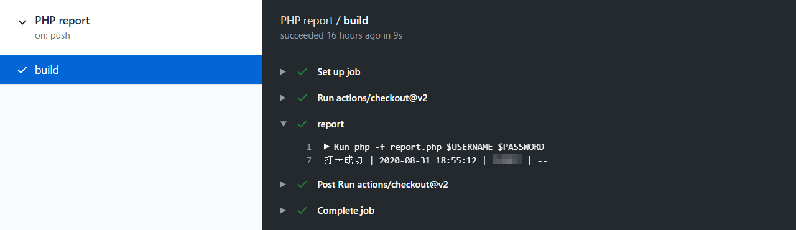

# CTSU健康打卡平台自动打卡脚本


## 介绍

本打卡脚本基于PHP开发，仅供学习交流使用，作者对于使用本脚本导致的问题不承担相应责任。

## 更新

2021-08-17 学校打卡平台更新了部分健康上报的数据格式，增加了位置县区代码、14天是否旅居中高风险地区等选择项，增加了先研院与国金院2个校区。

2021-07-30 云打卡增加了打卡失败的邮件提醒

2021-03-20 东区校园网节点下线

此前fork的项目可能需要fetch upstream同步主分支到最新版本以正常运行。

## 使用

### 通过自建PHP运行环境

0. 搭建PHP运行环境，PHP版本＞7.3，无需MYSQL，也可以使用docker部署。(打卡脚本资源占用较少，可以在openwrt、群晖等轻量环境下运行)

1. 将本仓库clone到本地并上传至您的PHP运行环境。也可以仅上传report.php文件，通过composer安装依赖。
```
composer require fabpot/goutte
```
2. 修改report.php文件中的健康上报数据为自己的数据。默认数据为东区正常在校。


3. 通过计划任务工具定时访问report.php页面，linux环境下使用corntab，win环境下使用任务计划程序，也可以使用第三方云监控定时访问URI。
```
yourhost/report.php?username=USERNAME&password=PASSWORD
```

### 通过Github Action

1. 将本仓库fork到自己的github。
   
2. 修改report.php文件中的健康上报数据为自己的数据。默认数据为东区正常在校。

   
3. 修改.github/workflows/php.yml文件中第7行的schedule为自己需要打卡的时间。如果您不知道如何设置时间，可以先了解 [POSIX cron](https://pubs.opengroup.org/onlinepubs/9699919799/utilities/crontab.html#tag_20_25_07) 表达式。注意这里使用的是**UTC时间**，即北京时间减去8小时。
   
4. 选择Settings选项卡点选左侧secret，创建名为USERNAME和PASSWORD的secret，值分别为自己统一身份认证的账号(学号)和密码。


5. 选择Actions选项卡启用自己仓库的Action，当push到master分支或计划时间时将会自动运行report.php打卡，在Actions界面选择PHP report -> build可以查看打卡结果。

   
6. 在Github个人设置页面开启Email通知(可选)。
   
### 通过云平台

您也可以使用由本仓库作者提供的带图形界面的云打卡平台

[阿里云教育网节点](http://auto.biqiqi.com.cn) *▶正常维护中*

~~[西区校园网节点](http://lxk.b77.tech:10888)~~ *■已转交同学维护*

~~[东区校园网节点](http://mxh.b77.tech)~~ *■已停止维护*


注意：
+ 作者对该云平台运行的稳定性不作任何保证，该云平台随时可能停止服务。(若停止服务，已注册使用的用户将收到邮件通知)
+ 云平台需要存储您的统一身份认证账号和密码(非公开)，请确认知悉这一点再使用。

## 数据配置

建议参照健康打卡平台相关设置项:[打卡平台](https://weixine.ustc.edu.cn/2020/home)
1. now_address: 当前所在地 ( 内地:1, 香港:2, 澳门:4, 台湾:5, 国外:3 )

2. now_province: 当前省份 ( 行政区域代码 安徽省为340000 )
   
3. now_city: 当前城市 ( 行政区域代码 合肥市为340100 )
   
4. is_inschool: 是否在校 ( 东区:2, 南区:3, 中区:4, 北区:5, 西区:6, 先研院:7, 国金院:8, 校外:0 )
   
5. body_condition: 身体状况 ( 正常:1, 疑似:2, 确诊:3, 其他:4 )
   
6. now_status: 当前状态 ( 正常在校:1, 正常在家:2, 居家留观:3, 集中留观:4, 住院治疗:5, 其他:6 )
   
7. has_fever: 发热症状 ( 无:0, 有:1 )
   
8. last_touch_sars: 接触确诊或疑似病例 ( 无:0, 有:1 )

9. is_danger: 当前居住地是否为疫情中高风险地区 ( 无:0, 有:1 )

10. is_goto_danger: 14天内是否有疫情中高风险地区旅居史 ( 无:0, 有:1 )


## 相关项目

其他开发者的一个基于python3的打卡脚本[URC-ncov-AutoReport](https://github.com/Violin9906/URC-ncov-AutoReport.git)
   
## TODO LIST

1. GitHub Action 打卡失败时进行重试

2. 自适应数据项填充 
