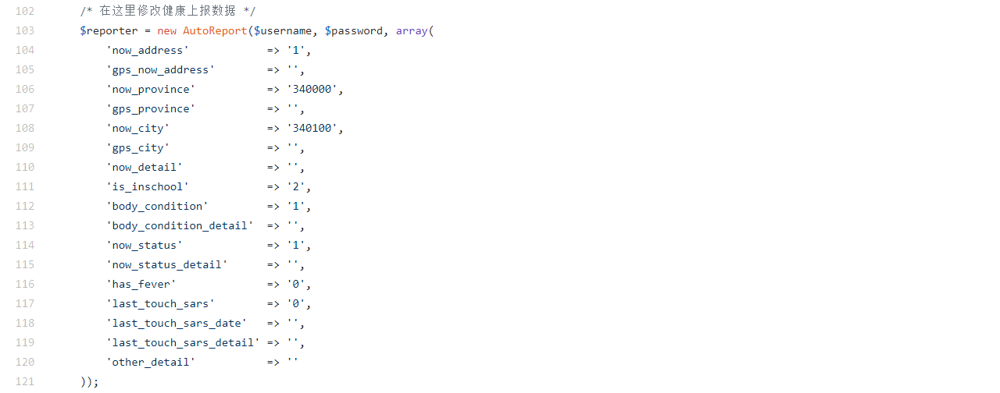
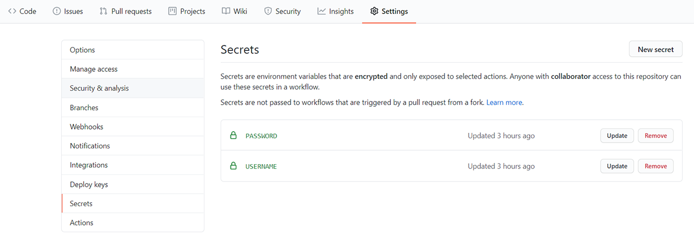
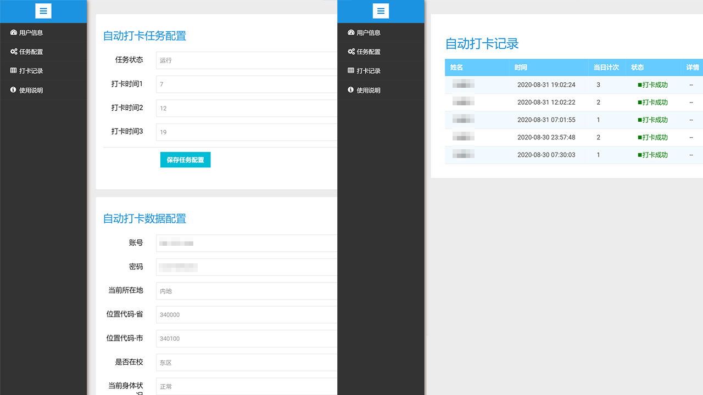

# CTSU健康打卡平台自动打卡脚本


## 介绍

本打卡脚本基于PHP开发，仅供学习交流使用，作者对于使用本脚本导致的问题不承担相应责任。

## 使用

### 通过自建PHP运行环境

0. 搭建PHP运行环境，PHP版本＞7.3，无需MYSQL，也可以使用docker部署。(打卡脚本资源占用较少，可以在openwrt、群晖等轻量环境下运行)

1. 将本仓库clone到本地并上传至你的PHP运行环境。也可以仅上传report.php文件，通过composer安装依赖。
```
composer require fabpot/goutte
```

2. 通过计划任务工具定时访问report.php页面，linux环境下使用corntab，win环境下使用任务计划程序，也可以使用第三方云监控定时访问URI。
```
yourhost/report.php?username=USERNAME&password=PASSWORD
```

### 通过Github Action

1. 将本仓库fork到自己的github。
   
2. 修改report.php文件中的健康上报数据为自己的数据。默认数据为东区正常在校。

   
3. 修改.github/workflows/php.yml文件中第7行的schedule为自己需要打卡的时间。如果您不知道如何设置时间，可以先了解cron表达式。
   
4. 选择Settings选项卡点选左侧secret，创建名为USERNAME和PASSWORD的secret，值分别为自己统一身份认证的账号(学号)和密码。


5. 选择Actions选项卡启用自己仓库的Action。
   
6. 在Github个人设置页面开启Email通知(可选)。
   
### 演示demo

你也可以使用由本仓库作者提供的带图形界面的云打卡平台
[CTSU云打卡](http://auto.biqiqi.com.cn)


注意：作者对该demo的稳定性不作任何保证，该demo随时可能停止服务。

## 数据配置

建议参照健康打卡平台相关设置项:[打卡平台](https://weixine.ustc.edu.cn/2020/home)
1. now_address: 当前所在地 ( 内地:1, 香港:2, 澳门:4, 台湾:5, 国外:3 )
2. now_province: 当前省份 ( 行政区域代码 安徽省为340000 )
3. now_city: 当前城市 ( 行政区域代码 合肥市为340100 )
4. is_inschool: 是否在校 ( 东区:2, 南区:3, 中区:4, 北区:5, 西区:6, 校外:0 )
5. body_condition: 身体状况 ( 正常:1, 疑似:2, 确诊:3, 其他:4 )
6. now_status: 当前状态 ( 正常在校:1, 正常在家:2, 居家留观:3, 集中留观:4, 住院治疗:5, 其他:6 )
7. has_fever: 发热症状 ( 无:0, 有:1 )
8. last_touch_sars: 接触确诊或疑似病例 ( 无:0, 有:1 )


## 相关项目

其他开发者的一个基于python3的打卡脚本[URC-ncov-AutoReport](https://github.com/Violin9906/URC-ncov-AutoReport.git)
   
## TODU LIST

1. 自建PHP环境运行的邮件提醒
2. 打卡失败时进行重试
